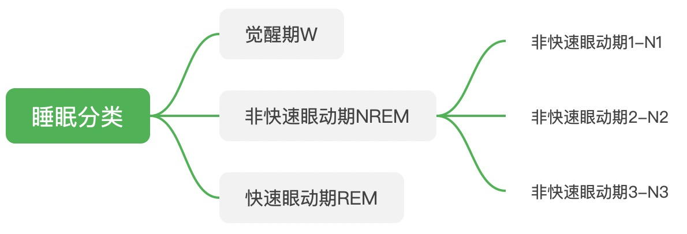

## 文献综述
### 1. 研究背景与意义
睡眠是人机体恢复和巩固的重要环节，并且会以各种方式影响人们的身体健康，对个人精神状态、学习能力和身体机能起着至关重要的作用[1-2]。根据2019年发布的《中国睡眠质量调查报告》，有83.81%的被调查者经常受到睡眠问题困扰，成年人失眠发生率高达38.2%,超过3亿中国人有睡眠障碍。根据丁香医生《2019国民健康洞察报告》，76%的公众受到的睡眠困扰是睡眠障碍。所以睡眠问题是一个很普遍的公共卫生问题。睡眠问题常常会引起各种睡眠相关疾病，目前常见的睡眠相关疾病有阻塞性睡眠呼吸暂停（Obstructive Sleep Apnea，OSA）和失眠症等，都对人身体健康造成很大的影响。文献[3]和[4]表明，90%以上的抑郁症患者都有睡眠障碍相关疾病。

在医学领域，睡眠分析是研究和诊断人睡眠相关疾病不可或缺的一环，是完成睡眠质量评估的前提[2]。而睡眠分类则是完成睡眠分析中最重要的一步，也是医学和研究人员分析睡眠最重要的工具。人的睡眠过程可以根据生物电信号分为不同的时期，比如R&K标准，将人睡眠分为六期（即 W,REM,S１,S２,S３,S４）。另外还有美国睡眠协会（AASM）2007年提出的AASM标准，标准中睡眠阶段重新分类为阶段 W（觉醒），阶段 N1-N3（非 REM）和阶段 R（REM），AASM标准如图0-1所示。

睡眠分类通常需要根据采集到的病人的整晚多导睡眠检测数据（Polysomnographic,以下简称PSG），然后让拥有睡眠研究经验的专家进行手动分类。通常，PSG信号包括脑电信号（Electroencephalogram，以下称EEG），眼电信号（Electrooculogram，EOG），肌电信号（ Electromyogram，EMG），心电信号（Electrocardiogram，ECG）。 PSG记录包括多个信号通道，由专家进行人工手动处理，对睡眠进行分类，不仅人力成本巨大，而且容易出现人为错误，往往繁琐且耗时。专家对一个病人的整晚睡眠进行分类通常需要花费2-4个小时，并且一些研究表明，专家人工手动分类的准确率往往低于90%[5]。此外，采集病人PSG信号需要让患者整晚佩戴多个相关仪器，会对人造成非常大的不适感。EEG信号在睡眠的人工手动分类和算法自动分类中都是最重要且最常用的信号，因此使用可穿戴的单通道EEG信号采集设备成为目前研究的主流[6]。

基于EEG信号的睡眠自动分类算法主要可以分成两类，一类是传统的机器学习方法，该方法需要信号处理手段对EEG信号进行预处理，再建立分类模型；二是深度学习方法，近年来深度学习技术取得了巨大的进步，特别是在图像处理领域。基于深度学习的医学影像处理技术，已经取得了巨大的应用，在器官CT图像分割识别上已经实现落地，方法快速、精确，对医生进行辅助性诊疗起到了很大的帮助。同样，深度学习技术也在生物信号处理领域有着非常大的应用价值[10]。

### 2. 国内外研究现状

从上世纪60年代开始就有研究人员利用计算机程序辅助睡眠分类[11]。经过几十年的发展，目前基于EEG信号的睡眠分类方法主要可以分为以下三类:

1. 人工手动分类，方法依赖经过大量训练的睡眠医学专家根据自身的经验知识进行手动分类。
2. 机器学习方法，需要传统信号处理中的滤波算法对EEG信号进行预处理以及特征提取，然后在利用分类器分类。该方法的局限性在于睡眠分类的效果非常依赖于提取的特征。
3. 深度学习方法，方法利用深度神经网络自动提取EEG信号在睡眠时期的特征，再结合特定的分类器（如Solfmax）对睡眠进行分类。自动提取特征的过程避免了特征选取的主观性，所以是目前研究的主流方向。

三种睡眠分类算法流程图如下：

（**插入图片**）

其中，基于机器学习算法和基于深度学习算法即为自动分类算法[1,2,7]。在机器学习算法中，通常需要使用传统的信号处理手段对原始的EEG信号进行降噪和特征提取，然后将提取到的特征参数作为睡眠自动分类机器学习模型的输入，模型从输入的特征中学习到睡眠特征和各个睡眠阶段的映射关系，最后依据两者的映射关系实现睡眠的自动分期。该类方法比较依赖于睡眠特征的提取，准确的睡眠特征参数对模型的分期效果起着至关重要的作用[8]，并且需要针对不同的数据集进行人工特征设计。该类方法**提几个精度不错的算法**

**然后聊一聊 深度学习算法，提几个算法**

当前，以卷积神经网络为代表的深度学习算法在计算机视觉领域取得了巨大的进步，特别是在医学图像识别领域，很多深度学习模型已经能够达到甚至超越专家的水平。基于深度学习的睡眠自动分类算法借助于深度神经网络进行自动特征提取，避免了特征选取的主观性，然后使用分类器进行睡眠自动分类（如softmax），可以达到非常好的效果。比如伦敦帝国理工学院的Akara Supratak等人在2017年提出的DeepSleepNet模型中[9]，利用CNN(Convolutional Neural Networks)卷积神经网络可以有效的提取EEG信号中的时不变特征，同时训练双向LSTM学习睡眠阶段转换规则的时间信息编码。该模型不需要任何的手工特征提取的过程，并且提高了睡眠分类的精度，可以有效的提高睡眠分类的效率，有益于医生对于睡眠疾病的诊断。所以基于深度学习的EEG信号处理方法是未来的趋势之一。

### 参考文献
1. Aboalayon K A I, Faezipour M, Almuhammadi W S, et al. Sleep stage classification using EEG signal analysis: a comprehensive survey and new investigation[J]. Entropy, 2016, 18(9): 272.
2. Şen B, Peker M, Çavuşoğlu A, et al. A comparative study on classification of sleep stage based on EEG signals using feature selection and classification algorithms[J]. Journal of medical systems, 2014, 38(3): 18.
3. Aboalayon, K.A.; Faezipour, M. Multi-class SVM based on sleep stage identification using EEG signal. In Proceedings of the IEEE Healthcare Innovation Conference (HIC), Seattle, WA, USA, 8–10 October 2014; pp. 181–184.
4. Huang, C.-S.; Lin, C.-L.; Ko, L.-W.; Liu, S.-Y.; Sua, T.-P.; Lin, C.-T. A hierarchical classification system for sleep stage scoring via forehead EEG signals. In Proceedings of the IEEE Symposium on Computational Intelligence, Cognitive Algorithms, Mind, and Brain (CCMB), Singapore, 16–19 April 2013; pp. 1–5.
5. Hassan A R, Bashar S K, Bhuiyan M I H. On the classification of sleep states by means of statistical and spectral features from single channel electroencephalogram[C]//2015 International conference on advances in computing, communications and informatics (ICACCI). IEEE, 2015: 2238-2243.
6. Hassan A R, Bhuiyan M I H. Automatic sleep scoring using statistical features in the EMD domain and ensemble methods[J]. Biocybernetics and Biomedical Engineering, 2016, 36(1): 248-255.
7. 高群霞,周静,吴效明.基于脑电信号的自动睡眠分期研究进展[J].生物医学工程学杂志,2015,32(05):1155-1159
8. 何垣谛. 睡眠分期算法研究[D].电子科技大学,2019.
9. Supratak A, Dong H, Wu C, et al. DeepSleepNet: a model for automatic sleep stage scoring based on raw single-channel EEG[J]. IEEE Transactions on Neural Systems and Rehabilitation Engineering, 2017, 25(11): 1998-2008.
10. Min S, Lee B, Yoon S. Deep learning in bioinformatics[J]. Briefings in bioinformatics, 2017, 18(5): 851-869.
11. Itil T M, Shapiro D M, Fink M, et al. Digital computer classifications of EEG sleep stages[J]. Electroencephalography and clinical neurophysiology, 1969, 27(1): 76-83.